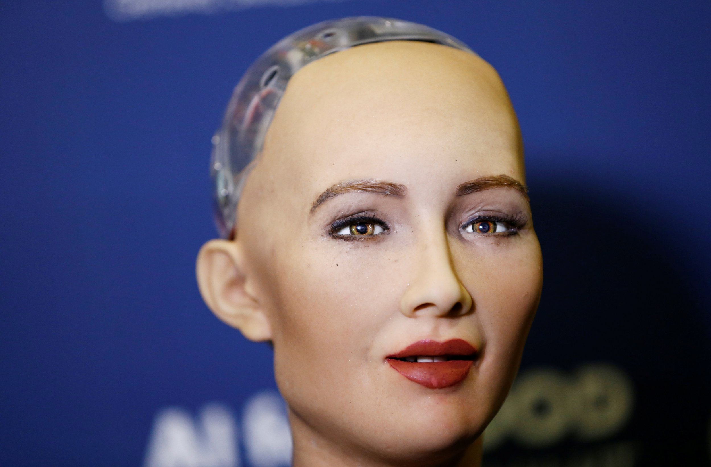

*Sophia, the AI robot.*

## Changes in day-to-day life 
The COVID pandemic has changed my daily routine in nearly every conceivable way. I typically work at a smoothie shop and my coworkers and I have somehow been deemed “essential workers”. I’m lucky to have not been laid off, but I decided to forgo working for the moment; I am considered at risk for serious illness. So, now I spend all day every day at home. Going grocery shopping has always been the bane of my existence, but now, I'm excited to go just to get out of the house! I'm grateful to have the ability to stay home, and especially grateful for those who are continuing to work during this time.

##  Academic effects?
My ability to learn has been majorly impacted by the shift to online classes. At first, I thought online classes would be amazing; I would have an extra 2-3 hours in the day that I would usually spend commuting to the university, I would save gas, save money on food, and I would be able to wake up as late as I wanted. I was excited to use this free time to get ahead on school work and ace all my assignments! My expectations of having free time were met, but I didn't anticipate how difficult it would be to get myself to focus on school. 

Now, it sounds pretty idiotic, but I think the feeling that “I have so much time” is detrimental to my ability to learn. I haven’t had an extended period in which I don't have to go to work or school in 5 years, and I’ve learned that the structure that work and school provides is beneficial for my productivity. My days have been blending and my concept of time is kind of skewed, I misjudge how much time I have to complete assignments and I've forgotten to turn in completed assignments. It’s very difficult to keep my mind on school with the distractions in my house, and anxiety about the pandemic certainly doesn't help either. I look forward to spending my time and gas going to classes in person when this is all over.

## Lessons learned
My company is not doing anything to ease the struggles of their employees, so I am currently not getting paid. My coworkers and I spoke to upper management and made demands of how we would like to be treated during this pandemic, and they responded saying they would only provide their employees with what they are legally mandated to provide. This showed me that I should seek employment elsewhere ASAP. I need to make some changes to my routine so I can use my free time wisely. I think setting an allotted timeslot each day where I only do school work would help. I also started setting alarms to remind myself of due dates so I can’t forget (or pretend I forgot to ease the guilt) to turn any assignment in.

