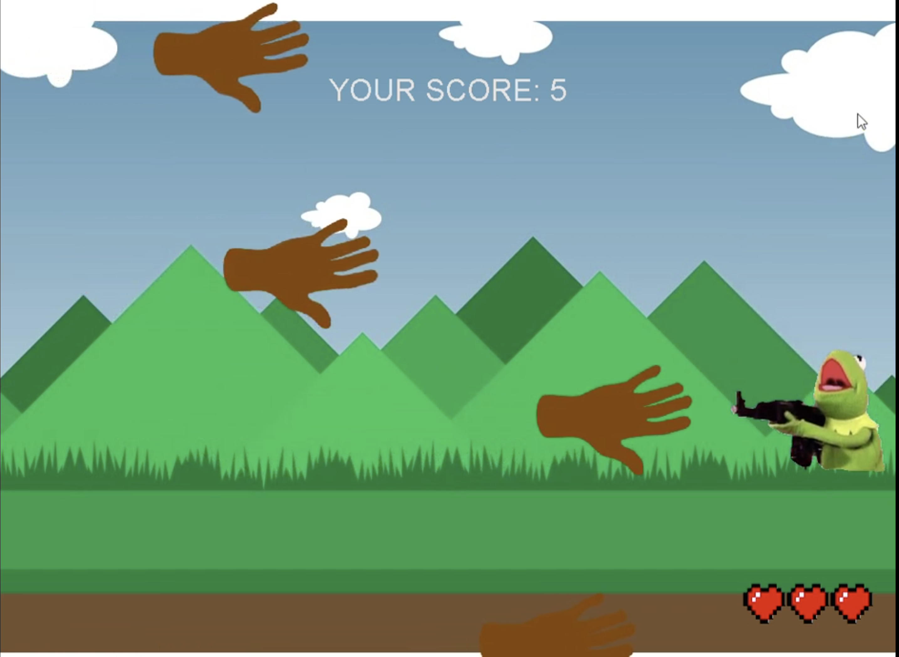

For this project, I worked with my peer in programming the different classes required for this game.  I started by programming the basics, such as setting up the images and formatting them correctly.  From there, I then programmed the keyboard inputs according to their purpose in the game.  The "W" and "S" keys are used to move the player, and the spacebar is used to shoot.  Next, I added the enemies to the screen using an array of images, they are added to the leftmost edge of the window at random y-values, when the enemies "spawn" they move across the screen at random speeds.  From there, I created functions to make the program register when the player was hit by the enemy, and vice versa.  The game keeps track of your score and diplays it when you lose.

Here is some code that illustrates how we determined if the enemy is hit:

```js
// hits is initially 1 
int hits;

while(Player.laser.getXCenter() > -100 ) {
	hits = 1;
	//moves the laser from the gun to the left of the screen
	Player.laser.moveForward(-70 );
	for(int j = 0; j<handHolder.length; j++) {
	// detects when the laser hits a hand and teleports it back to the left of the screen
		if (Player.laser.getXCenter() <= handHolder[j].getXCenter() &&
		(Player.laser.getYCenter() <= handHolder[j].getYCenter()+handHolder[j].getHeight()/2 && 
		handHolder[j].teleport2();
		hits--;
	}
```

You can watch a demonstration here (https://www.youtube.com/watch?v=uDI-i-WEaTo&feature=share).


