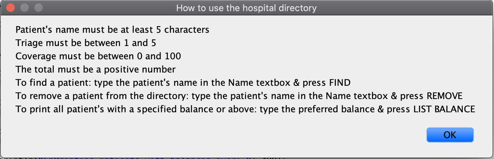
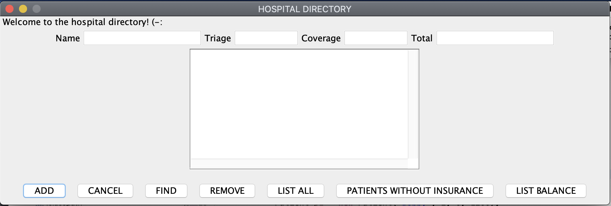
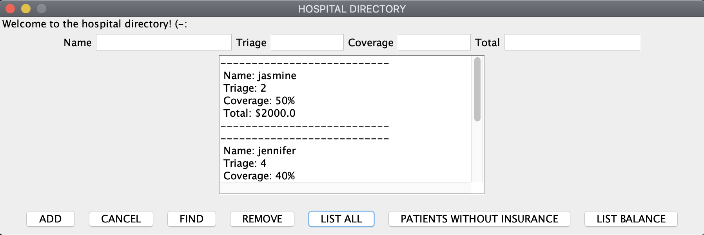

How the program works:

When the program runs, a pop up window explains how to use the hospital directory.

The user presses 'okay' and the directory appears. User is prompted to enter a patients name, pain triage, insurance coverage, and total balance owed. From here the user has a few options. 

They can add the patient to the directory, clear the text boxes with 'cancel', find or remove a patient by name, list all patients in the directory, list all patients without insurance, or list all patients with a specific balance.

Programming:

There are five classes involved in these project. The first step was creating all necessary get and set methods, and within each set method the limitations are implemented (i.e. patient name must be greater than 5 characters). The next step was creating the exception class, to use when throwing an exception (when a patient's name is greater than 5 characters). A toString was necessary to format the display of each patients information. The next step was creating nodes of each patient object, get and set methods were utilized. The nodes are used in creating a linked list of nodes. The linked list is essential in checking the information of each patient. Then, I created functions to reference within the hospital directory. The last step was implementing the GUI and formatting the menu to be user friendly.

Example of a function i created:

//function used to remove node by name
public void removeNode (String inputName) throws PatientException{
	Nodep cursor = front;
	Nodep previousNode=front;
	//while the name of the patient is not the name youre looking for
	while(! cursor.getPatient().getName().trim().equalsIgnoreCase(inputName.trim())) {
				
		//if youre at the end of the linked list
		if(cursor.getNext() == null) {
			System.out.println("Patient to be removed was not found");
			return;
		} else {
			previousNode = cursor;
			cursor = cursor.getNext();	
		} 
	}
	//if the first node is a match, remove it
	if(cursor == front) {
		front = front.getNext();
				
	//if theres a match in a node after the first node, remove it
	} else {
		previousNode.setNext(cursor.getNext());
	}
		
	//if the first node is a match, remove it
	if(cursor == front) {
		front = front.getNext();
	//if theres a match in a node after the first node, remove it
	}else {
		previousNode.setNext(cursor.getNext());
	}
}

